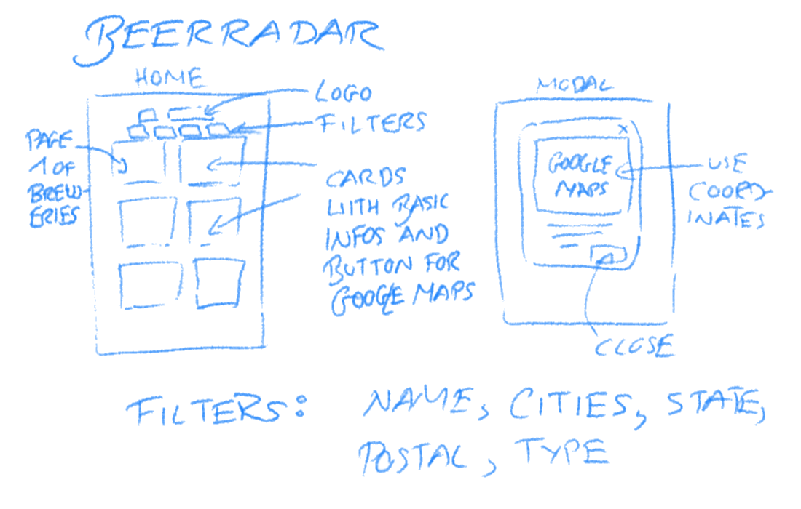
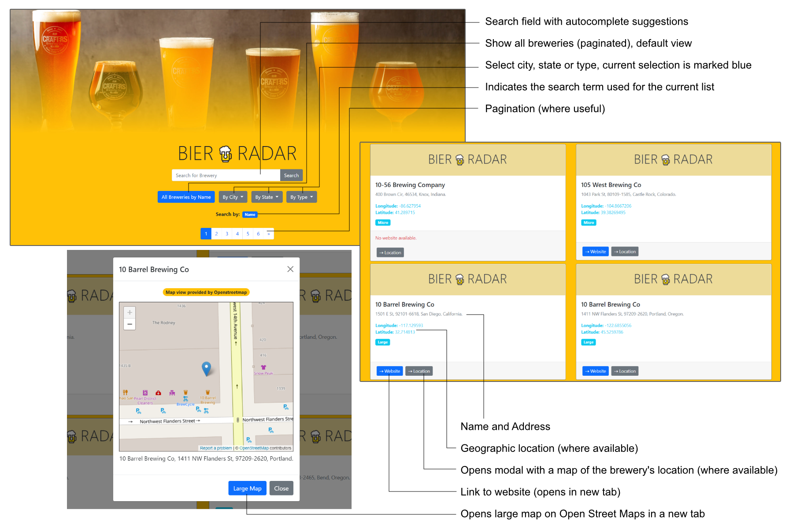

# Bierradar

Welcome to __Bierradar__. This list of beer breweries in North America using the API from *Open Bewery DB*. __Bierradar__ is a frontend built using vanilla JavaScript using Axios for the API at https://www.openbrewerydb.org/

__Bierradar__ was developed by __Marin Balabanov__ and is deployed on production here: https://marincomics.com/bierradar/

## Concept
The original idea was to create a simple UI to search for breweries in North America, list their details and to provide a modal with their location using the map service *Open Street Maps* https://www.openstreetmap.org

__The original sketch for the UI:__

## Implementation
Bierradar uses as many of the API features of *Open Bewery DB* as possible. The initial view shows the list of all breweries in alphabetic order paginated at 20 items per view.

Users can enter a search term. They are then presented with autocomplete suggestions for exact matches. Once triggered, the search itself is applied not only to a brewery's name but also the address and other data. In contrast to the autocomplete suggestions, it is a fuzzy search with close matches to the search term also showing results. The further down the search results, the greater the deviance from the original search term.

Underneath the search bar, dropdown menus provide lists of cities, states and brewery types (e.g. by size, etc.). The selected filter for the current display is indicated above the pagination. The pagination is only displayed if there are more than one page of results.

__The UI of Bierradar:__

## API Limitations
The UI would definitely benefit from a sort order. The API documentation of the Open Brewery DB describes a flag for the sort order. Unfortunately, the reality shows different results. An initial implementation of the sort order had to be abandoned.

Of the available API calls, three kinds were not used in this implementation:

- __List by postal code:__ The API provides breweries listed by postal code. Unfortunately, most European users are unfamiliar with US postal codes and would benefit from a list of postal codes. There are no means in the API to call the available postal codes so that the UI can provide users with a list. Therefore, the UI does not provide a filter by postal codes.

- __Combined filters (e.g. type and state):__ The API provides a means to combine different filters on the brewery data, e.g. the brewery type (nano, regional, etc.) can be combined with a city or a state. Combining filter was not considered during the UI's conception and can be considered as a failing on the part of the frontend's developer (i.e. me). At a first glance, it sounds nifty to combine filters, yet the devil is in the detail. Not all filters *can* be combined in a meaningful sense. Adding this features will be considered in a future version of this frontend (if development should ever continue).

- __A Brewery's Distance from a Location:__ This frontend is a European implementation for test purposes. All listed breweries are on the territory of North America. Pretty much all users who will ever try https://marincomics.com/bierradar/ will be in Europe. While the API provides a means to calculate the distance of a brewery in North America from a given location, this feature has very little practical use for European users because *every* brewery is far away. A possible option to implement a distance anyway would be to provide a UI to select a location on a map and then calculate the distance to a brewery. This is an option that might be explored in future.
